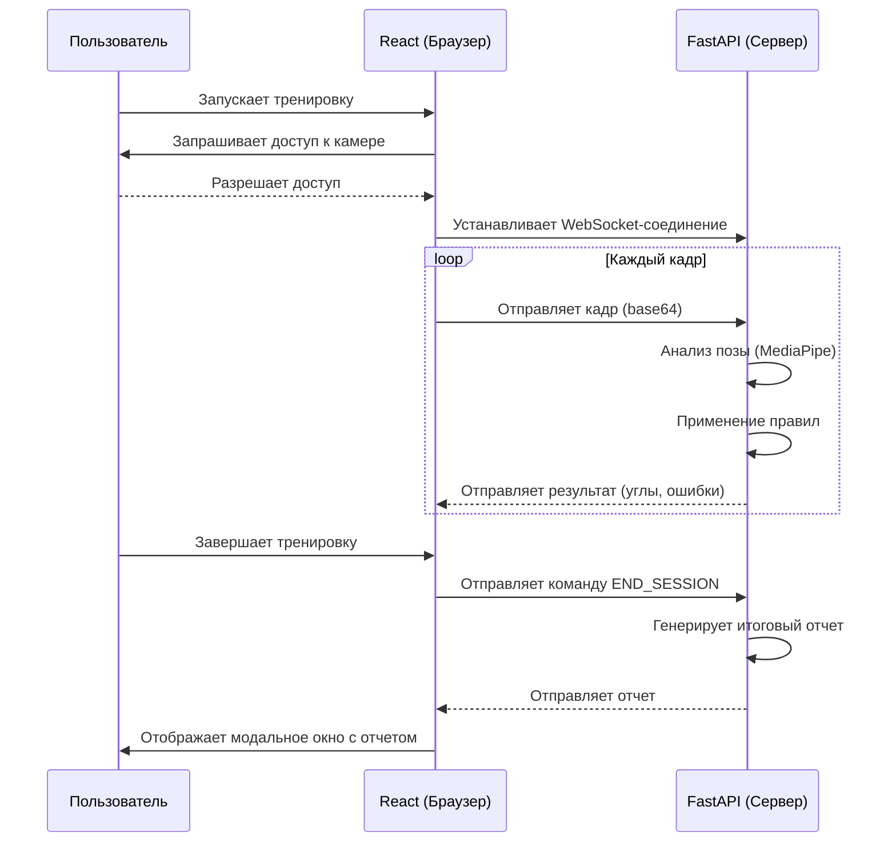

# 🏋️ KinetiCoach: Ваш ИИ-фитнес ассистент

[](https://github.com/[ВАШ_GITHUB_НИК]/[ВАШ_РЕПОЗИТОРИЙ]/actions/workflows/ci.yml)
[](https://github.com/astral-sh/ruff)
[-blue.svg)](http://mypy-lang.org/)
[](https://opensource.org/licenses/MIT)

**KinetiCoach** — это Full-Stack приложение, которое в реальном времени анализирует вашу технику выполнения приседаний с помощью веб-камеры и дает мгновенную обратную связь для исправления ошибок. Проект разработан как Telegram Mini App и демонстрирует создание высокопроизводительных real-time систем с использованием Computer Vision.

---

### 🎥 Демонстрация работы

> [!NOTE]
> [Вставьте сюда GIF с демонстрацией работы приложения]

---

### ✨ Ключевые возможности

*   **🏃‍♂️ Анализ в реальном времени:** Обработка видеопотока с веб-камеры для детекции позы с помощью MediaPipe.
*   **🤖 Детекция 5 ключевых ошибок:** Система распознает наиболее частые ошибки приседаний (наклон корпуса, глубина седа, выход коленей за носки и др.).
*   **📢 Мгновенная обратная связь:** Сразу после каждого повторения вы получаете визуальные подсказки о своей технике.
*   **📊 Итоговый отчет:** По завершении тренировки на экране отображается подробная статистика: общее количество повторений, число правильных и детализация по каждой ошибке.
*   **⚙️ Режим отладки:** Специальный режим для разработчиков, отображающий углы в суставах, состояние конечного автомата и "скелет" в реальном времени.

---

### 🏗️ Архитектура и Принцип работы

Приложение построено на двухкомпонентной архитектуре. Frontend (React) захватывает видео с камеры и отправляет его по WebSocket на Backend (Python/FastAPI). Бэкенд обрабатывает каждый кадр, анализирует позу и отправляет обратно на фронтенд результат анализа.



---

### 🛠️ Технологический стек

| Категория         | Backend (Python)                                  | Frontend (React)                               | DevOps & CI/CD                     |
| :---------------- | :------------------------------------------------ | :--------------------------------------------- | :--------------------------------- |
| **Язык**          | Python 3.11+                                      | TypeScript                                     | YAML                               |
| **Фреймворк**     | FastAPI                                           | React, Vite                                    | -                                  |
| **Real-Time**     | WebSockets                                        | Native WebSocket API                           | -                                  |
| **Computer Vision**| MediaPipe                                         | -                                              | -                                  |
| **Качество Кода** | `ruff` (lint+format), `mypy` (strict), `bandit`   | `eslint`, `prettier`                           | `pre-commit`, `husky`              |
| **Тестирование**  | `pytest`                                          | `Jest` (планируется)                           | -                                  |
| **Развертывание** | **Docker**                                        | **Docker** (Nginx)                             | **Docker Compose**, GitHub Actions |

---

### 🚀 Быстрый старт (Локальный запуск)

Для запуска проекта на вашей локальной машине вам понадобятся **Git** и **Docker Desktop**.

1.  **Клонируйте репозиторий:**
    ```bash
    git clone https://github.com/[ВАШ_GITHUB_НИК]/[ВАШ_РЕПОЗИТОРИЙ].git
    cd [ВАШ_РЕПОЗИТОРИЙ]
    ```

2.  **Настройте переменные окружения:**
    Скопируйте файл `.env.example` в новый файл `.env` внутри директории `backend/`.
    ```bash
    # Для Windows (PowerShell)
    cp backend/.env.example backend/.env
    ```
    *На данном этапе для локального запуска не требуется заполнять `.env` реальными значениями.*

3.  **Запустите все с помощью Docker Compose:**
    Эта команда соберет образы и запустит контейнеры для фронтенда и бэкенда.
    ```bash
    docker-compose up --build -d
    ```

4.  **Откройте приложение:**
    Перейдите в браузере по адресу [http://localhost:5173](http://localhost:5173).

---

### 📂 Структура проекта

```
.
├── .github/workflows/      # CI/CD пайплайн для GitHub Actions
├── backend/                # Backend-приложение на Python/FastAPI
│   ├── src/app/            # Исходный код приложения
│   ├── tests/              # Unit-тесты
│   ├── pyproject.toml      # Зависимости и конфигурация проекта
│   └── Dockerfile          # Инструкции по сборке Docker-образа
├── frontend/               # Frontend-приложение на React/TypeScript
│   ├── src/                # Исходный код и компоненты
│   ├── package.json        # Зависимости
│   └── Dockerfile          # Сборка статики и запуск Nginx
├── docker-compose.yml      # Файл для оркестрации контейнеров
└── README.md               # Этот файл
```

---

### ✅ Профиль качества и CI/CD

Проект настроен на соответствие "Production-Ready" стандартам качества:
*   **Backend:** Код автоматически проверяется с помощью `ruff`, `mypy` и `bandit` через `pre-commit` хуки.
*   **Frontend:** Код форматируется и линтится с помощью `prettier` и `eslint` через `husky`.
*   **CI/CD:** Настроен пайплайн в **GitHub Actions**, который запускает все проверки качества и тесты при каждом коммите в `master`, гарантируя стабильность кодовой базы.

---

### 📄 Лицензия

Проект распространяется под лицензией MIT. Подробности смотрите в файле [LICENSE](LICENSE).
